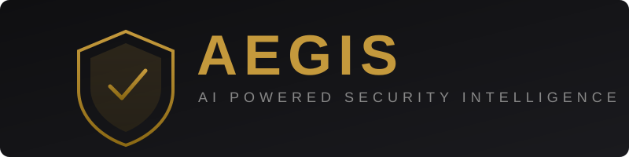

<p align="center">
  
</p>

<h1 align="center">
🛡️ AEGIS
</h1>

<h3 align="center">
AI Powered Security Intelligence Platform
</h3>

<p align="center">
Detect vulnerabilities. Explain risks. Recommend fixes.
</p>

<br/>


</div>


---

# 🚀 Live Demo

Frontend:

🔗 (https://frontend-rho-neon-60.vercel.app/)


Backend API:

🔗 https://aegis-0eke.onrender.com/docs


> ⚠️ Backend is deployed on Render Free Tier.
>
> Free instances automatically sleep after inactivity.
> The first request may take around 30-60 seconds while the server wakes up.


---

# 📌 Overview

AEGIS is an AI-powered smart contract security analysis platform designed to help Web3 developers identify, understand, and remediate Solidity vulnerabilities.

By combining static analysis with AI-driven reasoning, AEGIS analyzes smart contracts, detects security risks, explains vulnerable code patterns, prioritizes threats, and provides actionable remediation guidance.

Instead of manually reviewing thousands of lines of code, AEGIS combines:

- Artificial Intelligence
- Security pattern recognition
- Automated vulnerability analysis
- Explainable AI insights
- Developer-focused remediation


The objective:

> Build an AI-powered security intelligence assistant that helps Web3 developers detect, understand, and fix vulnerabilities in Solidity smart contracts before they become exploits.


---

## ✨ Key Features

### 🔍 Solidity Vulnerability Detection

Analyse Solidity smart contracts and identify common security issues including:

- Reentrancy vulnerabilities
- Access control weaknesses
- Unsafe external interactions
- Logic flaws
- Gas optimisation concerns


### 🤖 AI Security Reasoning

Beyond traditional static analysis, AEGIS explains:

- Why a vulnerability exists
- Potential impact
- Exploit scenarios
- Recommended fixes


### 📊 Security Reports

Generate developer-friendly reports containing:

- Vulnerability severity
- Affected contract sections
- Risk explanation
- Suggested remediation


---

# 🏗️ Architecture

             USER

              |
              |

      Next.js Frontend
          (Vercel)

              |

          REST API

              |

      FastAPI Backend
         (Render)

              |

    --------------------

      AI Security Engine

      ML Models
      Rule Engine
      Pattern Detection

    --------------------

              |

      Reports Storage


---

# 🛠️ Tech Stack


## Frontend

| Technology | Purpose |
|---|---|
| Next.js | React Framework |
| TypeScript | Type Safety |
| Tailwind CSS | Styling |
| React | UI Components |


## Backend

| Technology | Purpose |
|---|---|
| FastAPI | REST API |
| Python | Backend Logic |
| Uvicorn | Server |
| Pydantic | Data Validation |


## AI / ML

| Technology | Purpose |
|---|---|
| Scikit-learn | Machine Learning |
| NLP | Pattern Analysis |
| ML Models | Risk Prediction |


## Deployment

| Platform | Usage |
|---|---|
| Vercel | Frontend Hosting |
| Render | Backend Hosting |
| Docker | Containerization |


---

# 📂 Project Structure

AEGIS
│
├── frontend
│   ├── src
│   ├── app
│   ├── components
│   └── package.json
│
├── backend
│   ├── app
│   ├── models
│   ├── routes
│   ├── requirements.txt
│   └── Dockerfile
│
├── screenshots
│   ├── dashboard.png
│   ├── report.png
│   └── scan.png
│
└── README.md

---

# ⚙️ Local Installation

## Clone Repository

```bash
git clone https://github.com/RMP2005/Aegis.git

cd Aegis
```

---

# Frontend Setup

```bash
cd frontend

npm install

npm run dev
```

Frontend runs on:

```
http://localhost:3000
```

---
## Continuous Integration

This project uses GitHub Actions for automated checks.

Every push and pull request runs:
- Backend dependency installation
- Backend test suite
- Frontend dependency validation
- ESLint checks
- Production build verification

This ensures code quality and deployment reliability.

# Backend Setup

```bash
cd backend

python -m venv venv
```

Activate environment:

### macOS / Linux

```bash
source venv/bin/activate
```

### Windows

```bash
venv\Scripts\activate
```

Install dependencies:

```bash
pip install -r requirements.txt
```

Run backend:

```bash
uvicorn main:app --reload
```

Backend runs on:

```
http://localhost:8000
```

---

# 🔐 Environment Variables

## Frontend `.env.local`

```env
NEXT_PUBLIC_API_URL=http://localhost:8000
```

## Backend `.env`

```env
OPENAI_API_KEY=your_api_key_here

CORS_ORIGINS=http://localhost:3000

ENABLE_DOCS=true

REPORTS_DIR=reports
```

---
# Supported Input:

✅ Solidity (.sol) smart contracts

Future:
- Multi-contract analysis
- Repository level scanning
- Deployment security checks

# 🚀 Deployment

## Frontend

Deployed using Vercel.

Steps:

1. Import repository into Vercel
2. Select `frontend` as Root Directory
3. Choose Next.js framework
4. Add environment variables
5. Deploy


## Backend

Deployed using Render Web Service.

Steps:

1. Connect GitHub repository
2. Select backend directory
3. Use Docker runtime
4. Deploy service


## ⚠️ Render Free Tier

The backend currently uses Render Free Tier.

Due to free instance sleep behaviour:

- First request after inactivity may take 30-60 seconds
- Service automatically wakes after request
- Later requests work normally


This setup is suitable for:

- Hackathon demos
- Portfolio showcase
- Testing environments


For production workloads consider:

- AWS EC2
- AWS ECS
- Google Cloud Run
- Azure App Service
- Railway
- Fly.io


---

# 🐳 Docker Deployment

Run complete application:

```bash
docker-compose up --build
```

---

# 📸 Screenshots


---

# 🗺️ Roadmap

## Completed ✅

- AI security analysis
- Vulnerability detection
- Security dashboard
- Automated reports
- Cloud deployment


## Future Improvements 🚀

- Advanced ML vulnerability classification
- Real-time repository scanning
- GitHub Actions integration
- Automated security pull requests
- Enterprise security reports
- Multi-language support


---

# 🤝 Contributing

Contributions are welcome.

```bash
git checkout -b feature-name

git add .

git commit -m "Added feature"

git push origin feature-name
```

Create a Pull Request 🚀


---

# ⭐ Support

If you found AEGIS useful:

- Star this repository
- Share feedback
- Suggest improvements


---

# 📜 License

This project is licensed under the MIT License.


---

# 👨‍💻 Built With ❤️

Built by developers who believe security should be intelligent, automated, and accessible.


